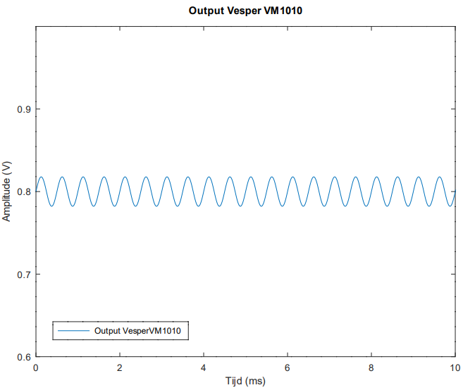
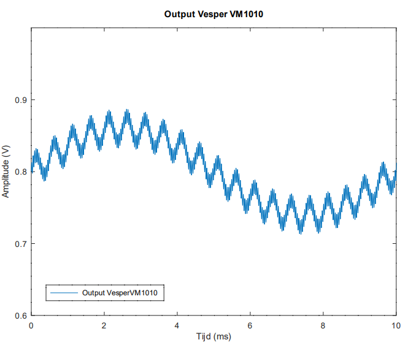

# Hoe geluid meten?

## Geluid opmeten met een microfoon

Geluid kan opgemeten worden met een microfoon die geluidsgolven omzet in elektrische signalen. Het zijn als het ware druksensoren die snel variërende drukken kunnen detecteren aan de hand van een diafragma dat meetrilt met de geluidsgolf. De beweging van het diafragma kan op basis van verschillende effecten worden omgezet tot elektrische signalen. 
Microfonen onderscheiden zich van elkaar op basis van een aantal eigenschappen, zoals grootte, bandbreedte (welk frequentiebereik kan je opmeten?), 
directionaliteit (is welke richtingen kan je geluid opmeten?), sensitiviteit (hoe gevoelig is de microfoon voor zachte geluiden?) en dynamische eigenschappen.

## Hoe werkt onze microfoon?

De microfoon dit in dit project gebruikt wordt, is gebaseerd op het piëzo-elektrisch effect en genereert een elektrisch equivalent van een geluidsgolf. 
Het piëzo-elektrisch effect is het verschijnsel dat kristallen van bepaalde materialen onder invloed van druk, bijvoorbeeld door buiging, een elektrische spanning produceren en andersom: 
er zijn materialen die vervormen als er een elektrische spanning op wordt aangelegd. 
Geluid is een drukgolf en kan dan ook een elektrische spanning produceren.

De frequentie van het geluid zal overeenkomen met de frequentie van het elektrische signaal. 
De amplitude van de geluidsgolf zal evenredig zijn met de amplitude van het elektrische signaal. 
De signalen afkomstig van de microfoon zijn soms slechts enkele millivolt groot en bevatten ruissignalen die niet gunstig zijn voor de meting. 
Om het geluid en de geluidssterkte goed te kunnen inschatten, zal het elektrisch signaal met behulp van een versterker moeten versterkt worden. 
Een signaal versterken betekent dat we de amplitude doen toenemen, bijvoorbeeld door het hele signaal met een factor 100 te vermenigvuldigen. 

Om enkel die signalen over te houden die we kunnen horen (nuttige signalen), gebruiken we filters. Deze zullen de laag- en hoogfrequente ruis wegfilteren zodat enkel het gunstige signaal zo goed als mogelijk overblijft. 
Zoals hierboven beschreven bestaat een geluid uit verschillende frequentiecomponenten. 
Het door een microfoon opgenomen signaal bevat daarenboven stoorsignalen, we noemen dit ruis.
De ruis bevat niet noodzakelijk dezelfde frequentiecomponenten als het nuttige signaal.
Daarom kan je filters gebruiken. 
Wat een filter precies is, valt buiten het bereik van deze bundel, maar je kan een filter vergelijken met de filters die je kent, bv. een koffiefilter.
Een koffiefilter laat enkel de nuttige componenten door: enkel de koffie zelf, maar geen koffiegruis.
De filters waarover we hier spreken doet hopelijk hetzelfde: de nuttige componenten, het geluid zelf, worden doorgelaten. 
Andere stoorsignalen, ruis met hogere en lagere frequenties dan geluid dat mensen kunnen waarnemen, wordt verwijderd.

Links ziet u het meest gunstige geval van de elektrische representatie van een geluidsgolf van 2 kHz. 
Hierbij is geen hoog- of laagfrequente ruis zichtbaar in tegenstelling tot de figuur aan de rechterzijde. 
In de figuur rechts is laagfrequente ruis aanwezig: dit is de trage fluctuatie in de figuur. 
Er is ook hoogfrequente ruis aanwezig: dit zijn de snelle fluctuaties in het signaal. 
Door die snelle fluctuaties kleurt de grafiek rechts donkerder dan de grafiek links. 

 

*Kan jij achterhalen welke frequenties zowel de hoog- als laagfrequente ruis in dit voorbeeld heeft?*

Om de ongunstige frequenties weg te filteren, gebruiken we een hoog- en laagdoorlaatfilter. De filter haalt frequenties hoger dan 8 kHz en lager dan 50 Hz weg uit het elektrisch signaal. Zo verkrijgen we een elektrische representatie die het dichtst aanleunt bij het geluid die door een mens kan worden waargenomen.
Hierbij wordt geen filter tussen 20 Hz en 20 kHz toegepast.
Dit komt doordat mensen in de praktijk niet het hele frequentiebereik meer kunnen waarnemen, doordat je oren in de loop van je leven verslechteren. 
Bovendien zijn die hele lage en hele hoge frequenties vaak niet nuttig voor de meeste toepassingen.

In dit project zal men op 2 manieren de geluidsintensiteit kunnen opvragen. 
Enerzijds zal het mogelijk zijn om aan de hand van polling de geluidsintensiteit op te vragen. 
[Polling](../Configuration/what-is-polling.html) betekent dat het geluid gemeten wordt op het moment dat het gevraagd wordt. 
Anderzijds is het ook mogelijk om een [drempelwaarde](../Configuration/what-are-thresholds.html) in te stellen vanaf dewelke er een melding moet komen dat deze drempelwaarde overschreden wordt. 
