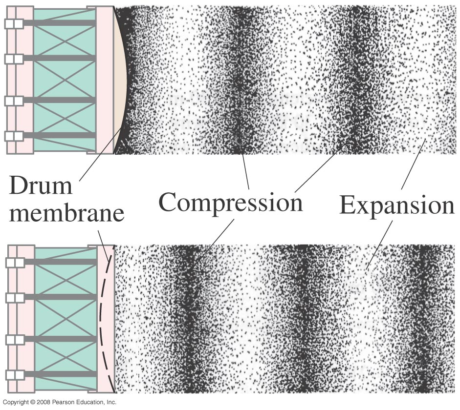
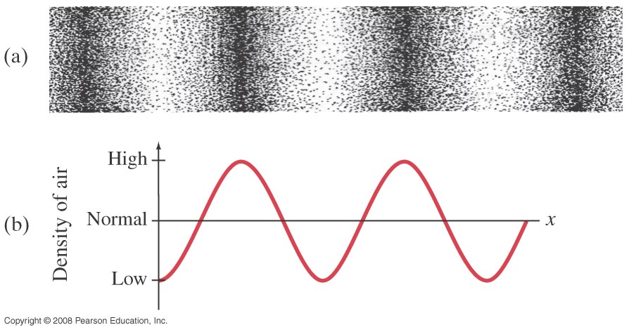
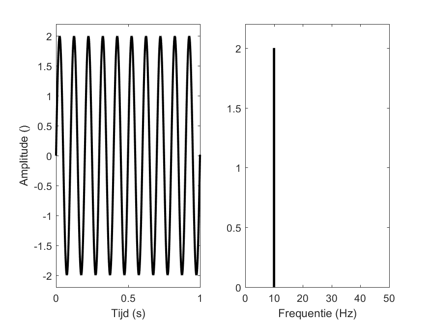
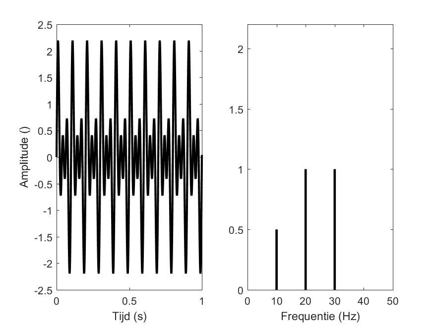
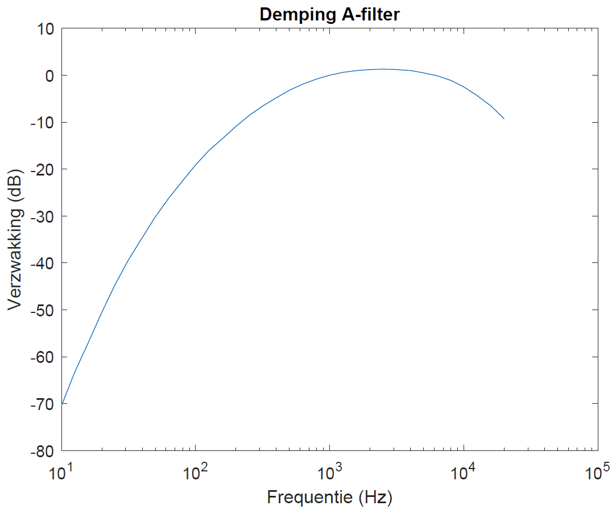

# Wat is geluid?

## Geluid
Geluid is een golf die ontstaat door een trilling van een voorwerp of een stemband. 
De trilling van de lucht neemt dezelfde frequentie aan als de trilling van het voorwerp. 
De trilling zal zich vervolgens als een golf door de lucht verplaatsen naar de ontvanger. 
Merk hierbij wel op dat de lucht ter plaatse blijft en dat het enkel de trilling is die wordt doorgegeven aan naburige luchtmoleculen.
De situatie is grafisch voorgesteld in onderstaande figuur. 

 "Door het bewegen van het membraan ontstaat een trilling van luchtmoleculen."
 "De trilling van de luchtmoleculen resulteert in drukverschillen in de ruimte, zoals weergegeven in de grafiek."

Door de trilling van de luchtmoleculen ontstaan drukverschillen: op sommige plaatsen zijn er relatief veel luchtmoleculen bij elkaar, daar is er een hogere 'luchtdruk'; op andere plaatsen zijn er relatief weinig luchtmoleculen bij elkaar, daar is er een lagere 'luchtdruk'.

Trillingen worden, wanneer deze de oorschelp bereiken, versterkt en opgenomen door
het trommelvlies in het oor. 
De hersenen zullen de signalen interpreteren waardoor het geluid kan
waargenomen worden.

## Fysische eigenschappen van geluid

Bij geluid zijn er twee aspecten die voor de mens onmoddeljk duidelijk zijn: *volume* en *toonhoogte*.
Dit zijn perceptieve aspecten, ze hebben verband met hoe een luisteraar het geluid *ervaart*. We noemen het daarom *subjectieve* gewaarwordingen.
Ze komen beiden overeen met *fysisch* meetbare grootheden.

*Volume* is gerelateerd aan *geluidsintensiteit*, dit is de hoeveelheid energie die per tijdseenheid door een eenheidsoppervlak gaat. 
De geluidsintensiteit wordt meestal uitgedrukt aan de hand van de geluidssterkte in decibel/dB.

De *toonhoogte* geeft aan of een geluid hoog of laag klinkt. De fysische grootheid die de toonhoogte bepaalt is de *frequentie*. 
Hoe hoger de frequentie, hoe hoger de toonhoogte; hoe lager de frequentie, hoe lager de toonhoogte.

### Geluidssterkte

De geluidssterkte wordt meestal uitgedrukt in decibel, afgekort als dB. 

De decibel drukt de geluidssterkte uit aan de hand van de verhouding van intensiteiten Ip en I0. 
Intensiteit is gedefinieerd als de energie die door een golf wordt getransporteerd per tijdseenheid door een eenheidsoppervlak loodrecht op de voortplantingsrichting van de golf. 
De eenheid van intensiteit is watt/meter2 (W/m2).
De intensiteit is evenredig met het kwadraat van de amplitude van de golf. 

Het menselijk oor is in staat om geluiden te horen met een intensiteit Ip tussen 10-12 W/m2 (gehoorgrens) en 1 W/m2 (pijngrens). Het is vanzelfsprekend dat de intensiteit hoger kan zijn dan de pijngrens, maar vervolgens pijn aan de oren veroorzaakt. 
Het intensiteitsbereik tussen de gehoorgrens en de pijngrens dat mensen kunnen waarnemen is ongelooflijk groot (10-12). 

Wellicht is hierdoor het volume dat wij ervaren niet recht evenredig met de intensiteit. 
Om een geluid te ervaren dat dubbel zo hard klinkt, moet de intensiteit ongeveer met een factor 10 toenemen. 
Daarom wordt een nieuwe grootheid ingevoerd: de *geluidssterkte* met als eenheid de decibel, afgekort als dB.

De geluidssterkte Lp wordt bepaald als het logaritme van de verhouding van de intensiteit Ip van het geluid ten opzichte van de gehoorgrens 
I0 = 10-12 W/m2: 

)

Van zodra men start met het refereren van een geluidsniveau ten opzichte van de gehoorgrens spreekt men ook van dBSPL (Sound Pressure Level). 
De vergelijking hieronder wordt ook frequent gehanteerd om de geluidssterkte te beschrijven aan de hand van drukken 
waarbij p0 ook wel de referentiedruk wordt genoemd en 20 &#956Pa bedraagt.

)

In de tabel hieronder zijn enkele typische geluidssterktes voor verschillende activiteiten weergegeven.

|dBSPL         | Geluidsbron | Intensiteit (W/m2) | 
| ------------- |:-------------:|:-------------:|
|0   | Gehoorgrens          |         10-12        |
	|10  | Ruisende bladeren    |       10-11 |
	|30  | Gefluister           |        10-9 |  
	|40  | Radio op achtergrond |      10-8 |
	|65  | Een gesprek op 0.5 m afstand    |    3.10-6|
	|70  | Druk restaurant      |         10-5 |
	|80  | Druk verkeer         |        10-4 |
	|90  | Vrachtverkeer        |        10-3 |
	|100 | Sirene op 30 m       |        10-2  | 
	|120 | Luid popconcert      |        1        |   
	|120 | Pijngrens            |        1        |   
	|140 | Straaljager op 30 m afstand  |        100     |   

### Toonhoogte

De *toonhoogte* van een geluid wordt bepaald door de frequentiecomponenten die aanwezig zijn in een bepaald geluid. Wanneer voornamelijk componenten met een hoge frequentie aanwezig zijn, dan zal het geluid als een hoge toon worden ervaren en vice versa. 

De trilling hierboven (links) is een harmonische trilling, die als een sinusvormig signaal voorgesteld wordt en met als functievoorschrift 

<!---\\[\
y(t) = A \sin(2\pi f t) \\]--->
=A\sin(2\pi&space;f&space;t))

- Links is de trilling voorgesteld in het tijdsdomein: de uitwijking in functie van de tijd is een sinusoïdaal verloop. 
- Rechts is de trilling voorgesteld in het frequentiedomein. 
Deze voorstelling noemen we dan ook het *frequentiespectrum*. 
De frequentie van een trilling is gedefinieerd als het aantal trillingen per seconde. 
De eenheid is 1/s of Hertz (Hz). Hoe we frequentiespectrum  bepalen, is voer voor universiteitsstudenten.

Deze trilling is een *zuivere toon*: er is slechts 1 frequentie aanwezig. In het frequentiespectrum zien we maar 1 lijn. Het is het geluid dat je hoort als je een stemvork aanslaat.

Naast zuivere tonen bestaan ook samengestelde tonen. De meeste geluiden die je kent, zijn samengestelde tonen, waarin meerdere frequenties voorkomen. Hieronder zie je een voorbeeld.

Het functievoorschrift van de afgebeelde trilling is 

=0.5\sin(2\pi&space;10t)&plus;1\sin(2\pi&space;20t)&plus;1\sin(2\pi&space;30t))

De amplitude en frequentie van de samengestelde toon kan je uit het functievoorschrift afleiden: 
A1 = 0.5$, f1 = 10 Hz, A2 = 1, f2 = 20 Hz, A3 = 1 en f3 = 30 Hz. 
De waarden van de aanwezige frequenties en amplitudes afleiding uit de linkergrafiek in het tijdsdomein is niet zo eenvoudig afgeleid worden. 
Het frequentiespectrum komt hiervoor veel beter van pas: de samengestelde trilling is opgebouwd uit drie zuivere trillingen, 
één op 10 Hz met amplitude 0.5, één op 20 Hz met amplitude 1 en één op 30 Hz met amplitude 1.

In het algemeen kan een samengestelde toon geschreven worden als een som van N zuivere tonen, elk met amplitude An en frequentie fn:

=\sum_{n=1}^{N}A_n\sin(2\pi&space;f_n&space;t))

Kortom: de frequentiecomponenten van een geluid vindt je aan de hand van het frequentiespectrum. 
Dit drukt de intensiteit van de verschillende frequentiecomponenten uit die aanwezig zijn bij een bepaald geluid. 

Het menselijk ook is gevoelig voor frequenties van 20 Hz tot 20 kHz. 
Naarmate men ouder wordt, wordt het oor ongevoeliger voor hoge frequenties waardoor deze stiller of niet ervaren zullen worden.

<!---\todo{Zo een grijze kolom met: Test jouw eigen gehoor. Tot welke frequentie kan jij horen?}--->

De gevoeligheid van het gemiddeld menselijk oor is afgebeeld onderstaande figuur. 
Uit deze grafiek kan men afleiden dat zowel de lage bastonen als de hoge pieptonen verzwakt worden waargenomen. 
<!---
% In heel wat meetapparatuur wordt een filter verwerkt zodat de meetapparatuur de geluidssterkte opmeet die de mens zou ervaren en niet de werkelijke fysische intensiteit.
\todo{Beter uitleggen}
-->

 Vorm van een A-filter

*Bepaal zelf aan de hand van de grafiek voor welke frequenties het oor het meest gevoelig is. Voor welke frequentie wordt een bepaald geluid 10 keer stiller ervaren dan het in werkelijkheid is?*

## Verzwakking van geluid
Geluid ondergaat door heel wat factoren een *verzwakking* of *attenuatie*. Temperatuur, luchtvochtigheid, afstand, de luchtdichtheid en de frequentie van het geluid spelen hierbij allemaal een rol.

We bekijken eerst verzwakking van geluiden in de vrije ruimte. Daarmee bedoelen we een ruimte waarin geen objecten staan. Dit is quasi onmogelijk in de praktijk. Dit is dus slechts een theoretisch concept.
Geluidsverzwakking met toenemende afstand tot de geluidsbron in de vrije ruimte heeft twee onderliggende oorzaken.
Ten eerste is lucht een elastisch medium en zal dit ervoor zorgen dat er verzwakking optreedt. Wanneer geluidsgolven door lucht propageren, worden luchtmoleculen versneld. 
Die versnelling zorgt onvermijdelijk voor wrijving. 
Wrijving is een vorm van energieverlies, wat leidt tot een verzwakt geluid.
Ten tweede is er het effect van *divergentie*. 
Dat betekent dat het vermogen van een geluidsgolf uitgespreid wordt over een groter oppervlak naarmate deze geluidsgolf zich verder van de bron bevindt. 
In de vergelijking hieronder wordt de verzwakking van de amplitude van een geluidsgolf berekend in functie van de afstand.

&plus;11)

Hierbij is
- Ddiv: de verzwakking ten opzichte van een geluid waargenomen op de referentieafstand
- d: de afstand van de waarnemer ten opzichte van de geluidsbron
- d0: de referentieafstand (van de bron) waartegenover we de verzwakking bepalen

*Met hoeveel dB zal de amplitude afnemen van een geluidsgolf wanneer de referentie afstand 1m bedraagt en wij een geluid horen op 6m afstand?*

In een omgeving met objecten zullen er heel wat verzwakkingsfactoren bijkomen zoals grondeffecten, reflecties en obstakels. De totale verzwakkingsvergelijking is heel complex en wordt in dit college niet behandeld.

Als vuistregel hanteert men dat de intensiteit van het opgevangen geluid met 6 dB afneemt telkens de afstand tot de geluidsbron verdubbelt.

## Geluidsnormen en milieuwetgeving

dB-meters worden tegenwoordig vaak gebruikt op fuiven, concerten en festivals. Dergelijke evenementen zijn sterk onderworpen aan heel wat regels vervat in de milieuwetgeving. Deze regels trachten zowel buren als aanwezigen te beschermen tegen gezondheidsschade.

Geluid afkomstig van muziekactiviteiten kan opgedeeld worden in drie categorieën die bepaald worden aan de hand van het equivalent continu geluidsniveau (LAeq). 
Dit is het constante geluidsdrukniveau dat gedurende een tijdsduur T dezelfde energie levert als de werkelijk gemeten geluidsdrukniveaus gedurende die tijdsduur T. 
Dit kan bijvoorbeeld zeggen dat het geluid over een periode van 15 minuten gemeten wordt en het gemiddelde lager moet zijn dan 95 dB. 
De 3 categorieën met bijhorende voorwaarden zijn hieronder weergegeven.

- **Categorie 1**: geluidsniveau <85 dB(A)LAeq, 15min
- **Categorie 2**: geluidsniveau > 85 dB(A)LAeq, 15min en <= 95 dB(A)LAeq, 15min
- **Categorie 3**: geluidsniveau > 95 dB(A)LAeq, 15min en <= 100 dB(A)LAeq, 60min

In theorie kan voor elke muziekactiviteit gekozen worden welke categorie van toepassing is. 
In de praktijk zijn de organisatoren echter vaak ook beperkt tot een maximale categorie omwille van omgevingsfactoren zoals bijvoorbeeld de buren. 
Het is het Schepencollege en de Burgemeester van de betreffende gemeente die hierin het laatste woord hebben te zeggen. 