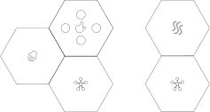

# Het IWAST Systeem
Het “IoT with a soft touch”-systeem bestaat uit: 
1. Sensoren, ook wel dochterborden genoemd. Het overzicht van de sensoren, hun aantallen en mogelijke toepassingen staat [hier](./../sensors/sensors.md).
2. Moederborden, die de elektronica die nodig is voor de draadloze communicatie bevatten, waarop telkens sensoren kunnen aangesloten worden
3. Eventueel: een powerbank: een batterij die de elektronica van energie voorziet. __Merk op__ dat je ook een power-module, een dochterbordje met zonnepaneel, op het moederbord kan aansluiten, waardoor een powerbank niet meer nodig is
4. Een gateway/toegangspoort. Sensorgegevens worden - na verwerking op het moederbord - draadloos naar de gateway doorgestuurd. De gateway stuurt die gegevens door naar de cloud, waardoor je de meetgegevens op een website kan raadplegen.

De moederborden maken een draadloze connectie met de gateway. 
De gegevens van de sensoren, aangesloten op elk moederbord, worden naar de gateway doorgestuurd. 
De gateway is verbonden met de server, waar de sensorgegevens opgeslaan worden. 
De data is toegankelijk via een website, zowel via de computer, als via de smartphone. Meer informatie kan je [hier](./../../SP5/Platform/platform.md) terugvinden.

__Let op!__ In het huidige systeem is geen terugkoppeling voorzien. 
Het is mogelijk data van sensoren op te vragen en te analyseren, maar signalen uitsturen kan momenteel (nog) niet! 
De communicatie is dus _eenzijdig_: de sensormodules kunnen gegevens uitsturen, maar kunnen - op dit moment - nog geen gegevens ontvangen. 
(Dus bv. een deur openen of een lichtje doen branden als een drukknop ingedrukt wordt, is voorlopig niet mogelijk).

__Let op!__ Het huidige systeem is niet regenwaterdicht. Je mag de sensoren dus niet onbeschermd buiten plaatsen. Indien je graag in de buitenlucht meetgegevens zou verzamelen, plaats de IoT 
opstelling dan onder een afdak, of bouw een opstelling om de IoT opstelling tegen weersinvloeden te beschermen. Neem contact op met iwast@kuleuven.be als je twijfelt aan de wind- en 
waterdichtheid van je opstelling!

# Draadloze communicatietechniek
Zoals hierboven aangehaald heeft de draadloze communicatietechniek een invloed op het energieverbruik van de moederborden. Zoals in elk ontwerpprobleem moet ook bij de keuze van de draadloze communicatietechnologie een evenwicht gezocht worden tussen verschillende vereisten. “There is no such thing as free lunch”: je kan niet alles krijgen in het leven wat je zou willen. 

Binnen dit project werd gekozen voor de communicatietechnologie LoRa (Long Range). 
We lijsten hieronder de voor- en nadelen van LoRa-communicatie op:
- <i class="fas fa-plus"></i> energiezuinig: de draadloze communicatie kost niet veel energie, waardoor de sensormodules lang op eenzelfde batterij kunnen functioneren zonder dat de batterij moet vervangen worden. Bij optimale condities zou een batterijduur langer dan jaar geen uitzondering mogen zijn.
+ <i class="fas fa-plus"></i> groot draadloos bereik: de sensoren kunnen tot op grote afstand gegevens naar de gateway doorsturen. In sommige gevallen tot wel 40 km ver! In praktische omstandigheden kan je berichten sturen tot wel enkele kilometers ver. 
- <i class="fas fa-minus"></i> Beperkte hoeveelheid data die kan doorgestuurd worden binnen een vast tijdsinterval. Daardoor is het niet mogelijk geluid of video continu door te sturen. Afhankelijk van het aantal en type sensoren kunnen sensormodules ten snelste ongeveer om de 5 minuten de sensorwaarden doorsturen. We raden wel aan minder frequent data door te sturen.

