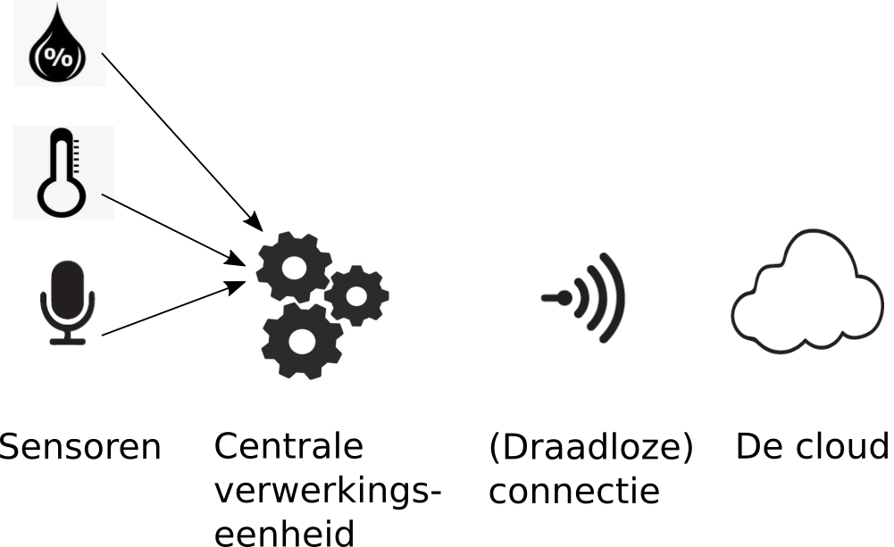

# Onderdelen van een IoT systeem
<!---IoT is een visie waarbij apparaten geconnecteerd worden. Daar zijn we uiteraard nog lang niet, maar vele mensen denken al na over de vereisten en de mogelijkheden van 
dergelijke systemen. Op kleinere schaal worden nu al IoT systemen in gebruik genomen. -->

We hadden het al over mogelijke applicaties, maar hoe ziet zo’n systeem er nu precies uit?

Een IoT-systeem bestaat uit vier grote onderdelen: 
1. sensoren die de omgeving scannen, 
2. een centrale verwerkingseenheid die de signalen van de sensoren omzet in bruikbare data, 
3. een connectie tussen de slimme apparaten en de cloud, en 
4. de cloud zelf.

## Sensoren
Een sensor zou je kunnen definiëren als een apparaat(je) dat een stimulus ontvangt en omzet in een elektrisch signaal. 
Een stimulus is de hoeveelheid, eigenschap of toestand die vertaalt wordt naar een elektrisch signaal. Voorbeelden van stimuli zijn: lichtinval, versnelling, geluid, afstand, 
temperatuur, chemische samenstelling, … Het resulterend elektrisch signaal is bijvoorbeeld een elektrische spanning of een elektrische stroom.
Vaak gebruikte sensoren in IoT toepassingen zijn camera’s, microfoons, temperatuursensoren en accelerometers. Een accelerometer kan de versnelling in x-, y- en z-richting meten.
 Maar er bestaan nog veel andere sensoren, bv. om je hartslag of stressniveau, om de grootte van een magnetisch veld of om de chemische samenstelling van een gas te meten.

## Centrale verwerkingseenheid
Het doel van de centrale verwerkingseenheid is het omzetten van de signalen uit de sensoren (analoog domein) naar data die verwerkt kan worden door computers (digitaal domein).
Simpel gezegd bestaat een analoog signaal uit continue meetwaarden die onbeperkte waarden kunnen aannemen. 
Een digitaal signaal bestaat uit discrete meetwaarden die op bepaalde tijdstippen gemeten worden en die slechts bepaalde waarden (bijvoorbeeld, maar niet noodzakelijk, enkel gehele getallen) kunnen 
aannemen. Door de centrale verwerkingseenheid zullen slechts beperkte berekeningen uitgevoerd worden, door zijn gelimiteerde rekenkracht. 

Het doel van deze hardware is voornamelijk het vertalen en verpakken van data uit het analoge domein naar het digitale domein die dan verder verwerkt kan worden in de cloud. 

## (Draadloze) connectie
Apparaten moeten informatie uitwisselen en combineren om werkelijk tot ‘slimme’ IoT toepassingen te leiden. Het uitwisselen van deze data gebeurt over een netwerk naar ‘de cloud’ voor verdere verwerking.
Neem als voorbeeld terug de ‘slimme’ thermostaat die je huis opwarmt tegen de tijd waarop jij thuiskomt. Een thermostaat op zich is niet ‘slim’ genoeg om dit te verwezenlijken.
Er kan echter gebruik gemaakt worden van andere sensoren zoals de GPS in de smartphone en/of smartwatch van de bewoner. Doordat deze sensoren met elkaar geconnecteerd zijn kan 
de thermostaat op voorhand het huis verwarmen en komt de bewoner toe in een warm huis.

## De cloud
De cloud staat voor een netwerk van computers die aanzienlijke data-opslag en rekenkracht ter beschikking stellen aan gebruikers.
In ons geval worden de gegevens van de sensoren in een IoT systeem gedeeld en opgeslagen in de cloud. Wat kan je nu met die gegevens doen?

- In monitoring toepassingen kan een gebruiker via een website die gegevens opvragen en die verder verwerken. Dit kan op zich al voldoende zijn om de probleemstelling aan te pakken. Denk hierbij bijvoorbeeld aan een stem-toepassing in de klas. Leerlingengroepen kunnen na discussie via drukknoppen stemmen of ze al dan niet akkoord gaan met een stelling. Die gegevens worden draadloos doorgestuurd naar de cloud en de leerkracht kan via een website nagaan hoeveel leerlingen akkoord zijn met de gegeven stelling.
- In event-based toepassingen zal een applicatie geactiveerd worden in bepaalde gevallen, denk bv. het automatisch verwittigen van de hulpdiensten indien de IoT sensoren indiceren dat een oudere man een ernstige val gemaakt heeft van de trap.
- In nog meer geavanceerde toepassingen is er terugkoppeling voorzien: denk bijvoorbeeld aan een ‘no school’-alarm dat afgaat van zodra een temperatuurdrempel in een klaslokaal overschreden wordt tijdens de hittegolf.
