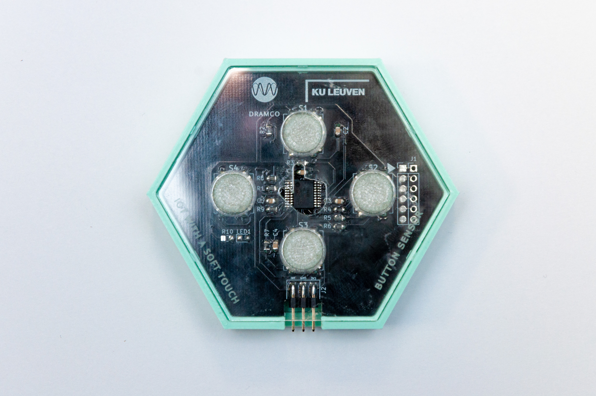

# Button Sensor

The button sensor contains four buttons.
Whenever a button is pressed, the motherboard sends a message to the cloud specifying which button was pressed.

This sensor does not need to be configured.

__Pay attention!__ In the current system, there is no feedback loop! It is possible to poll and analyse data from sensors, but sending signals to the sensor boards is not (yet) possible! It is a one-way communication: sensor boards can send data to the gateway, but cannot receive any signals or data. (So e.g., opening a door or lighting up a LED whenever a push button is pressed is currently impossible!).

## Applications
- Voting applications
	* e.g., groups of students vote over the right answer to teacher questions (almost real time)
	* e.g., monitoring student satisfaction about the food in the school restaurant (not real time)
- Alarm applications
	* e.g., in healthcare: calling a nurse with an indication of urgency
	* e.g., fall detection in the elderly population