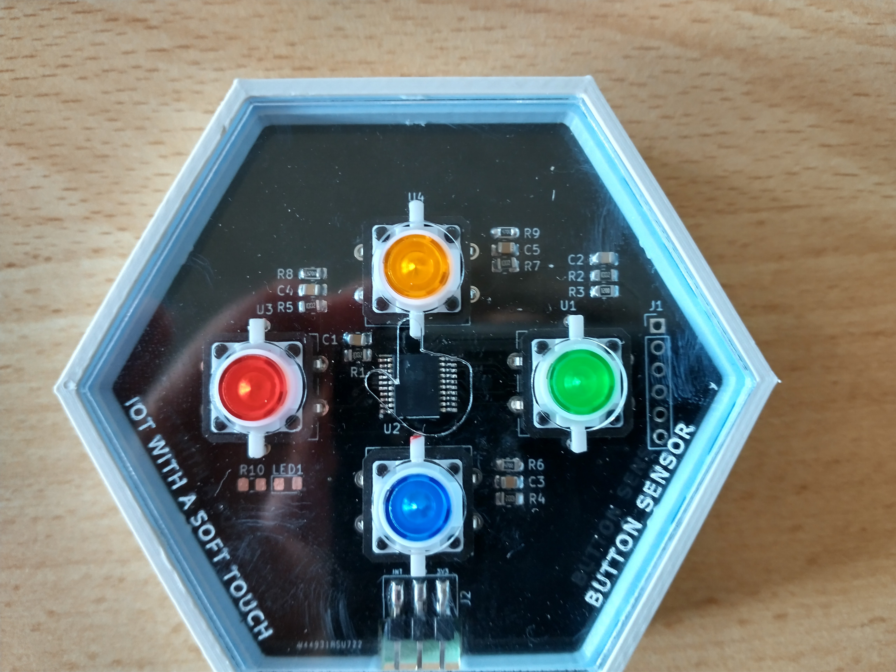

# Drukknopsensor

De drukknopsensor bevat vier knoppen.
Telkens wanneer een knop wordt ingedrukt, stuurt het moederbord een bericht naar de cloud waarin wordt gespecificeerd welke knop werd ingedrukt.

Het nummer van de knop kan je zien op het bordje. Het drukknopnummer is aangegeven met U1, U2, U3 en U4, zoals te zien is in onderstaande figuur. In het [platform (dashboard)](./../../SP5/Platform/platform.md) zie je het drukknopnummer (hier aangeduid met SW1 tot SW4) bovenaan de grafiek.

Deze sensor hoeft niet te worden geconfigureerd.

__Pas op!__ In het huidige systeem is er geen feedback loop! Het is mogelijk om gegevens van sensoren op te vragen en te analyseren, maar het zenden van signalen naar de sensorborden is (nog) niet mogelijk! Het is een eenrichtings communicatie: sensor boards kunnen data naar de gateway sturen, maar kunnen geen signalen of data ontvangen. (Dus b.v. een deur openen of een LED laten oplichten wanneer een drukknop wordt ingedrukt is momenteel onmogelijk!)

__Pas op!__ Je kan de drukknopsensor ongeveer 15 keer kort na elkaar indrukken. Nadien moet je enkele minuten wachten alvorens je opnieuw data kan doorsturen. Een alternatief is om telkens enkele minuten tussen een beperkt aantal (bv. 6) druk-acties te laten. 

## Toepassingen
- Stemtoepassingen
	* bv. groepen leerlingen stemmen over het juiste antwoord op vragen van de leraar (bijna in real time)
	* bv., monitoren van tevredenheid van leerlingen over het eten in het schoolrestaurant (niet real time)
- Alarmtoepassingen
	* bv., in de gezondheidszorg: een verpleegster oproepen met een indicatie van urgentie
	* bv. valdetectie bij ouderen
