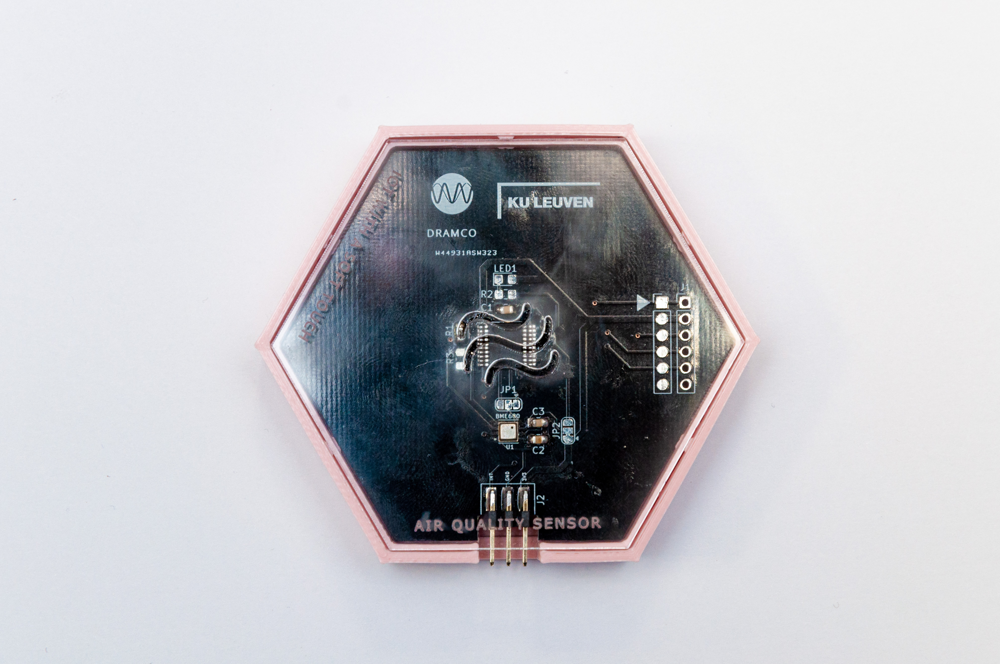

# Environmental Sensor

The environmental sensor measures the following:
- Temperature (&deg;C)
- Air pressure (hPa)
- Relative humidity (%)
- Air Quality Index (no unit)

## Air Quality Index

The environmental sensor contains a gas that can measure the amount of volatile organic compounds. Volatile organic compounds (VOCs) consist of a large range of organic substances that are gaseous at room temperatures, for example alcohols and ketones.
The concentration of gasses is usually expressed in parts-per-million (ppm). When the concentration is 1 ppm, it means that 1 molucule of VOCs is present for every million of air molecules.

Because the amount of VOCs in the air is directly related to local emissions, the VOC concentration is used as an indication of air quality. 
The air quality index is calculated based on the concentration of volatile organic compouds, temperature and humidity, based on an algorithm.

## Applications
- Monitoring classrooms
	* e.g., signaling when it is time to ventilate the classrooms
	* e.g., influence of the orientation of classrooms on temperature
	* e.g., influence of initiatives such as 'dikke truiendag' on classroom temperature
- Monitoring the school environment
	* e.g., is the air in the school environment harmful for students who bike to school?
- Monitoring plant breeding
	* e.g., determining optimal temperature and humidity to grow a certain plant
