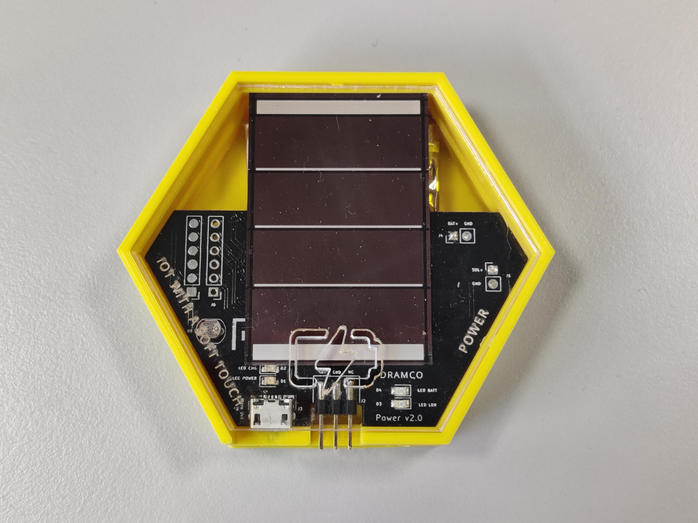

# Power / Light Sensor

The power / light sensor measures the following:
- Illuminance (lux)
- Battery voltage (V)

The power module can be used to provide energy to the whole system. 
The module is based around a battery which voltage is converted to a stable output voltage.
It includes a photovoltaic panel with an MPPT algorithm to efficiently extract microwatts to milliwatts of power from the solar panel and recharge the battery.

## Recharging the battery using USB
When the battery eventually does run out, it automatically disconnects the battery from the system. 
The battery can also be recharged via usb. When plugged in via usb, a green and red light turn on. Charging is completed when the red light turns off and only the green light remains on.

## Measuring incident light
This module includes an LDR (Light Dependent Resistor) which output is converted to an illuminance value. A measurement is indicated by a blue light.

### Illuminance

Illuminance is a metric for how much the incident light illuminates a certain suface area. 

| Lighting condition | From (lux) | To (lux) | Mean value (lux) |
|--------------------|------------|----------|------------------|
| Pitch Black        | 0          | 10       | 5                |
| Very Dark          | 11         | 50       | 30               |
| Dark Indoors       | 51         | 200      | 125              |
| Dim Indoors        | 201        | 400      | 300              |
| Normal Indoors     | 401        | 1000     | 700              |
| Bright Indoors     | 1001       | 5000     | 3000             |
| Dim Outdoors       | 5001       | 10,000   | 7500             |
| Cloudy Outdoors    | 10,001     | 30,000   | 20,000           |
| Direct Sunlight    | 30,001     | 100,000  | 65,000           |

## Measuring battery voltage

The power module uses a Lithium Polymer (LiPo) battery than can be used to power the whole system. Due to the chemistry of battery, the voltage is not linearly related to the remaining capacity, but can give a good indication of the state of charge. A measurement is indicated by a blue light.

## Applications
- Monitoring weather conditions
	* e.g., signaling when sun is shining - cloudy
	* e.g., day - night tracking
- Monitoring energy yield from the solar panel
	* e.g., how much energy is supplied by the solar panel?
- Monitoring state of charge
	* e.g., determining how much longer the system can measure
