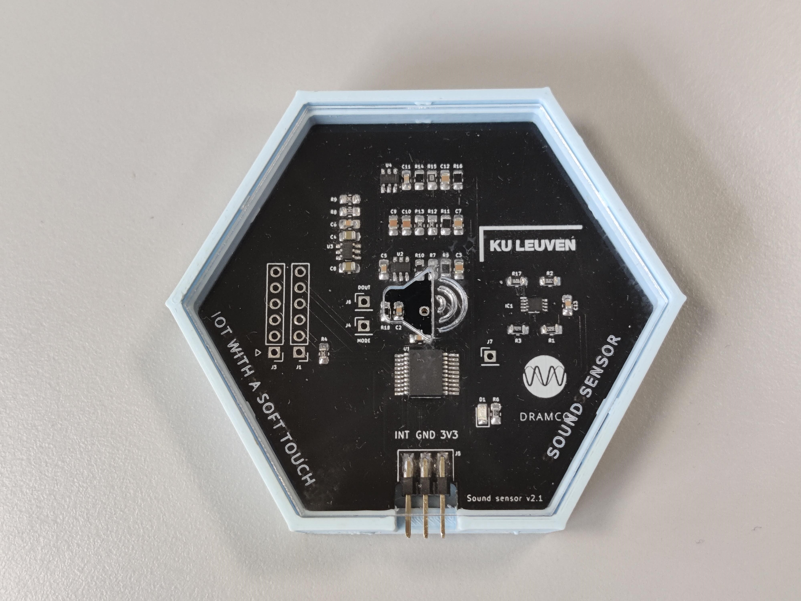

# Geluidsensor

Deze sensor meet het geluidsniveau.
U kunt het meten op vaste tijdsintervallen [polling]((./../../SP5/what-is-polling.html)) en/of de waarde zenden wanneer het niveau onder of boven een [drempel] komt(./../../SP5/what-are-thresholds.html)).

In de drempelmodus (thresholding) blijft de microfoon aan in een spaarstand en wordt het systeem gewekt telkens wanneer een geluidsevent wordt gedetecteerd. Het systeem berekent de dB-waarde en zendt deze naar het moederbord. Daarom is thresholding nuttig om te detecteren wanneer een vooraf ingestelde drempelwaarde voor het geluidsniveau is overschreden.

__Pas op!__ Vanwege de beperkte datasnelheid is het niet mogelijk geluid te streamen. De sensor zendt het geluidsniveau met regelmatige tussenpozen, of wanneer een vooraf ingestelde drempelwaarde is overschreden.

__Pas op!__ Door de manier waarop de geluidsniveaus worden berekend, bedraagt het gemeten geluidsniveau nog steeds ongeveer 50 dB. 
Daarom heeft het geen zin om te proberen "stille" geluiden te meten.
Het is ook niet toegestaan drempels lager dan 65 dB in te stellen, omdat dit zal leiden tot constante datatransmissie, wat veel stroom verbruikt en de batterij leeg zal trekken. 
Het is ook zinvol om tamelijk 'hoge' drempelwaarden te gebruiken, omdat thresholding vooral nuttig is om te detecteren wanneer vooraf ingestelde hoge geluidsniveaus zijn overschreden.

## Toepassingen:
- Bewaking van geluidsniveaus en/of 'geluidsvervuiling'
	* bv. bewaking van geluid op de speelplaats
	* bv. staat een feestje in de buurt te luid?
- Detectie van activiteiten:
	* bv. is er iemand aanwezig in een klaslokaal?

## Technische informatie

__Pas op!__ Vraag aan je leerkracht of het zinvol is dit stukje tekst door te nemen.

De geluidssensor bestaat uit een aantal onderdelen:

### Microfoon
Er is gekozen voor een Vesper VM1010 omdat dit een microfoon is met een laag stroomverbruik en goede prestaties. De microfoon verbruikt 87 µA in actieve modus (gemeten). Er is ook een mode-pin om de sleep-mode in te schakelen, wat de stroom reduceert tot ongeveer 5µA. Om de slaapstand in te schakelen, moet een laag niveau spanning aan de mode-pin worden toegevoerd en vice versa. De gevoeligheid van de microfoon is -38 dBV terwijl de frequentiekarakteristiek vlak is voor de hoorbare frequenties.

### Hoogdoorlaatfilter
Het passieve hoogdoorlaatfilter heeft een -3dB-frequentie van 100 Hz en verwijdert de DC-offset van 0,8 V die door de microfoon wordt geleverd. Er wordt slechts rekening gehouden met 1 wisseling van de geluidsgolf. Dit vermindert de kosten van de componenten en verhoogt de stabiliteit van de schakeling.

### Versterker
Een niet-inverterende versterker is gedimensioneerd om het signaal met 30 dB te versterken. Een TLV341 wordt gebruikt als operationele versterker omdat zijn bandbreedte produkt van 2.3 MHz vrij hoog is. De ruststroom meet ongeveer 70 µA per kanaal.

### Laagdoorlaatfilter
Een Sallen-Key laagdoorlaatfilter is gedimensioneerd met een -3dB-frequentie van 8 kHz om de amplitude van de ongewenste ultrasonische geluiden te verminderen. Een versterking van 2,73 dB versterkt het signaal tot een amplitude die geschikt is voor de ADC.

### Bias-spanning
Een stabiele biasspanning van 1,5 V wordt opgewekt en wordt gebruikt als DC-offset voor het audiosignaal. Hiermee compenseren we eventuele negatieve spanningen die we met de ADC niet zouden kunnen meten.

### Analoog-digitaal omzetter
De 12-bit ADC van de PIC16F18446 bemonstert het analoge signaal naar 16-bit waarden met een samplefrequentie van 20 kHz. De ADC meet de piek-tot-piek waarde van het versterkte audiosignaal. De PIC16F18446 bemonstert 1000 waarden om er zeker van te zijn dat de maximumwaarde zo dicht mogelijk het echte signaal benadert dat uit het analoge circuit komt. Telkens wanneer een drempelwaarde wordt overschreden, zal een interrupt het moederbord informeren dat een dB-waarde klaar is.

### Communicatie
De microfoonmodule communiceert met het moederbord via I2C-commando's om de drempelwaarde of het tijdsinterval in te stellen.
