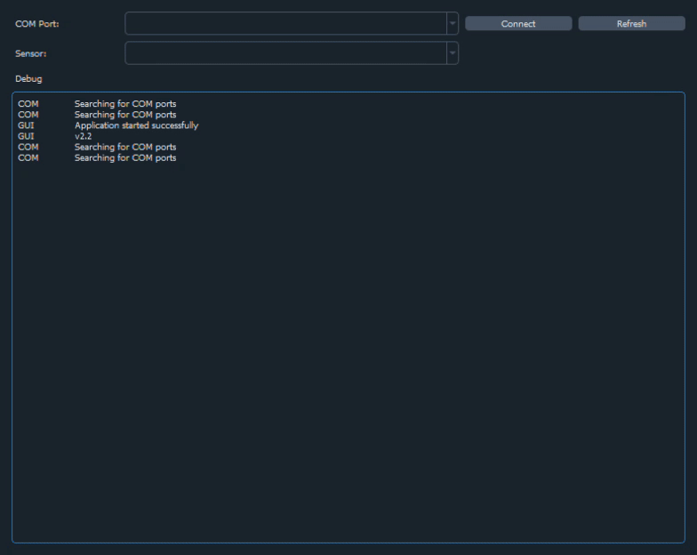

De configuratie-tool kan je downloaden via [https://github.com/dramco-iwast/qt-config/releases](https://github.com/dramco-iwast/qt-config/releases). 
Wanneer je het `IWAST.Configurator.V2.1Setup.exe` bestand opent, installeert de tool vanzelf op je computer.

Eerst nog wat uitleg over het moederbord. Op het moederbord zie je een grote ronde knop. Deze knop heeft verschillende doeleinden:
* tijdens de configuratie: reset-knop. Dit zorgt ervoor dat je het moederbord kan detecteren om het vervolgens te configureren
* tijdens gebruik van de IoT sensoren: feedback. 
    * Als de grote ronde knop oplicht, probeert het moederbord data van de sensoren draadloos door te sturen naar de cloud. 
    * Als het moederbord data verstuurd heeft, gaat het het lampje uit. Als het lampje continu oplicht, heeft het problemen om de data verstuurd te krijgen. 
        * Mogelijks heb te [teveel data verstuurd](./../SP2/iot/wireless-communication.md) en mag je even geen gebruik maken van het draadloze netwerk. In dat geval moet je wachten tot je weer toegang tot het netwerk krijgt. 
        * Een andere optie is dat er gewoon geen netwerk aanwezig is. Vraag je leerkracht om de controleren of de ontvanger operationeel is. Indien dat het geval is, moet je mogelijks dichter bij de ontvanger blijven met het moederbord.

Hieronder zie je een screenshot van de configuratie-tool. Voer de aangeduide stappen in volgorde uit ((a) tot (u)), zoals hieronder beschreven.

## Sensoren aansluiten en klaarmaken voor configuratie

**1 .**  Sluit de sensoren, uitgezonderd de vermogenmodule, aan op het moederbord. 

**2 .** Sluit als laatste de vermogenmodule aan.

**3 .** Plug de USB-kabel in in de computer.

**4 .** __Druk op de grote ronde 'reset' knop op het moederbord.__  **Opgelet** het moederbord zal na het drukken op de reset knop, maar voor 30 seconden detecteerbaar zijn door de configuratietool, waarna deze in slaap valt om zo energie te besparen. Dit wil dus zeggen dat het bord geconnecteerd moet zijn met de tool (zie hieronder) binnen de 30 seconden.

## Configuratie van het moederbord en sensoren

### Moederbord connecteren met de PC

* De aangesloten USB apparaten zie je rechtsboven (a).

**5 .** Vernieuw indien nodig het lijstje van USB apparaten door op 'refresh' te drukken (b).
Als je net het moederbord hebt aangesloten, zie je in het lijstje van USB apparaten nu wellicht een nieuwe COM-poort verschijnen. 
Dit is het nummer van de USB-poort waarop je je moederbord hebt aangesloten.
__Indien je de nieuwe COM-poort niet ziet verschijnen, heb je wellicht niet op de grote ronde 'reset' knop geduwd. Druk op de grote ronde 'reset' knop op het moederbord.__

**6 .** Selecteer het USB apparaat (de COM-poort waarop je moederbord is aangesloten) en druk op connect (c).

### Sensor(en) instellen

**7 .** Daarna moeten de sensoren die aan je moederbord geconnecteerd zijn in het lijstje (d) verschijnen. 
Selecteer de sensor die je wilt configureren. 

**8 .** Klik vervolgens op 'load' om de huidige configuratie (instellingen) van de sensor te bekijken (e).

**9 .** Pas de instellingen aan indien nodig. 
Bepaal ten eerste of je wilt werken via periodische of drempel-gebaseerde communicatie, of of je beide wilt combineren.
Meer info over periodische communicatie vind je [hier](what-is-polling.html) en over drempel-gebaseerde communicatie [hier](what-are-thresholds).

Als je de data van je sensor NIET periodisch wilt opvragen (GEEN polling), laat het polling interval dan op 0 staan.
Als je de data van je sensor WEL periodisch wilt opvragen (WEL polling), stel het polling interval dan in op het gewenste aantal minuten.
We raden aan het polling interval in te stellen op minimum 10 minuten.

(g) Als je de data van je sensor via interrupt-gebaseerde communicatie wilt opvragen, betekent dit dat ALLE sensordata doorgestuurd wordt wanneer een bepaalde drempelwaarde overschreden wordt.
Zo kan je bijvoorbeeld alle gegevens (temperatuur, luchtdruk, luchtvochtigheid en algemene luchtkwaliteit) van de luchtkwaliteitsensor opvragen van zodra de temperatuur hoger wordt dan 25 &deg;C.
Om dit te bereiken moet je bij 'Temperature &deg;C' threshold aanvinken, `TH` instellen op 25&deg;C en `TL` op een waarde hoger dan 25&deg;C, bv 100 &deg;C. 
Zo zal je de sensordata krijgen, elke keer als de temperatuur hoger wordt dan 25 &deg;C.

Bij sensoren die meerdere fysische grootheden meten, bv de luchtkwaliteitsensor, kan je voor meerdere fysische grootheden drempelwaarden instellen.
Merk op dat alle sensorgegevens worden doorgestuurd wanneer 1 drempelwaarde overschreden wordt. 
Stel dat je een drempel ingesteld hebt voor de temperatuur (doorsturen als temperatuur > 25 &deg;C) en luchtdruk (doorsturen als druk > 1060 hPa).
Als nu de drempelwaarde voor de temperatuur overschreden wordt, maar die voor druk niet, (of omgekeerd), dan worden toch alle gegevens (temperatuur, luchtdruk, luchtvochtigheid en algemene luchtkwaliteit) doorgestuurd.

__Pas op!__ De lage drempel (T_L) is niet actief voor de geluidsensor.

<!-- * __Het is aan te raden om gebruik te maken van data accumulatie__ (k). De data wordt hierbij gebufferd aan de zender en er wordt slechts een bericht uitgestuurd wanneer genoeg data verzameld is. 
Het systeem wordt hierdoor stabieler en verbruikt minder energie. 
Het kan hierdoor wel langer duren alvorens de eerste data toekomt in het online platform.   -->
**Opgelet** data accumulatie wordt momenteel nog niet ondersteund. We houden je op de hoogte wanneer de implmentatie hiervan klaar is.

**10 .** Als je tevreden bent over de instellingen voor je sensor, sla je de configuratie op (h). 

* Je krijgt wat info te zien in het vakje onderaan (i), maar daar hoef je je normaal gezien niets van aan te trekken. Deze informatie kan gebruikt worden om door te sturen naar iwast@dramco.be bij problemen.

### Instellingen opslaan en moederbord loskoppelen
{:start="11"}
**11 .** Nu moet je alleen nog op de knop 'disconnect' onderaan drukken om alle instellingen permanent op te slaan (j).
__Als je niet op 'disconnect' klikt, worden de instellingen NIET opgeslagen.__
Nu mag je de USB connectie met het moederbord loskoppelen.

__Pas op! Nadat je een combinatie van moederbord en sensormodules geconfigureerd hebt, moet je die behouden en mag je die niet opnieuw losmaken. Indien je sensormodules losmaakt, verwisseld, of nieuwe sensormodules op je moederbord aansluit, moet je de hele boel opnieuw configureren!__

**12 .** Stappen l t.e.m. u mag je negeren.

<!-- * Door op `Power Report` (l) te klikken verkrijg je een gedetailleerd overzicht van het vermogenverbruik van de sensor. 

* De huidige configuratie wordt weergegeven (m). 

* Je kan het aantal verwachte events boven en onder de thresholds instellen (n) alsook de draadloze communicatie instellingen (o). 

* Aan de hand van de aangesloten sensoren en deze instellingen wordt het gemiddeld vermogenverbruik (p) berekend alsook de geschatte autonomie (q). 

* (r) en (t) geven een meer gedetailleerd overzicht van het verbruik. 

* Deze energievoorspellingen kunnen ook geëxporteerd worden naar een PDF (s). 

* Sluit tenslotte dit venster (u). -->

