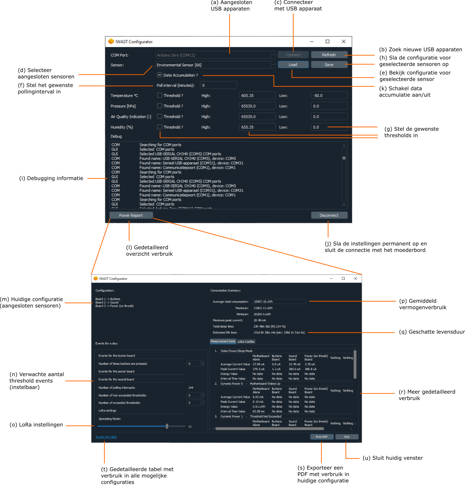

De configuratie-tool kan je downloaden via [https://github.com/dramco-iwast/qt-config/releases](https://github.com/dramco-iwast/qt-config/releases). 
Wanneer je het `IWAST.Configurator.V2.1Setup.exe` bestand opent, installeert de tool vanzelf op je computer.

Hieronder zie je een screenshot van de configuratie-tool. Voer de aangeduide stappen in volgorde uit ((a) tot (u)).

* De aangesloten USB apparaten zie je rechtsboven (a).
Sluit het moederbord, samen met de sensoren die je wilt configureren via USB aan je computer aan. 
Druk op de grote ronde 'reset' knop op het moederbord.

* Vernieuw indien nodig het lijstje van USB apparaten door op 'refresh' te drukken (b).
Als je net het moederbord hebt aangesloten, zie je in het lijstje van USB apparaten nu wellicht een nieuwe COM-poort verschijnen. 
Dit is het nummer van de USB-poort waarop je je moederbord hebt aangesloten.

* Selecteer het USB apparaat naar keuze (de COM-poort waarop je moederbord is aangesloten) en druk op connect (c).

* Daarna moeten de sensoren die aan je moederbord geconnecteerd zijn in het lijstje (d) verschijnen. 
Selecteer de sensor die je wilt configureren. 

* Klik vervolgens op 'load' om de huidige configuratie (instellingen) van de sensor te bekijken (e).

Pas de instellingen aan indien nodig. 
Bepaal ten eerste of je wilt werken via periodische of drempel-gebaseerde communicatie, of of je beide wilt combineren.
Meer info over periodische communicatie vind je [hier](what-is-polling.html) en over drempel-gebaseerde communicatie [hier](what-are-thresholds).

Als je de data van je sensor NIET periodisch wilt opvragen (GEEN polling), laat het polling interval dan op 0 staan.
Als je de data van je sensor WEL periodisch wilt opvragen (WEL polling), stel het polling interval dan in op het gewenste aantal minuten.
We raden aan het polling interval in te stellen op minimum 10 minuten.

Als je de data van je sensor via interrupt-gebaseerde communicatie wilt opvragen, betekent dit dat ALLE sensordata doorgestuurd wordt wanneer een bepaalde drempelwaarde overschreden wordt.
Zo kan je bijvoorbeeld alle gegevens (temperatuur, luchtdruk, luchtvochtigheid en algemene luchtkwaliteit) van de luchtkwaliteitsensor opvragen van zodra de temperatuur hoger wordt dan 25 &deg;C.
Om dit te bereiken moet je bij 'Temperature &deg;C' threshold aanvinken, `TH` instellen op 25 en `TL` op een waarde hoger dan 25, bv 100 (g). 
Zo zal je de sensordata krijgen, elke keer als de temperatuur hoger wordt dan 25 &deg;C.

Bij sensoren die meerdere fysische grootheden meten, bv de luchtkwaliteitsensor, kan je voor meerdere fysische grootheden drempelwaarden instellen.
Merk op dat alle sensorgegevens worden doorgestuurd wanneer 1 drempelwaarde overschreden wordt. 
Stel dat je een drempel ingesteld hebt voor de temperatuur (doorsturen als temperatuur > 25 &deg;C) en luchtdruk (doorsturen als druk > 1060 hPa).
Als nu de drempelwaarde voor de temperatuur overschreden wordt, maar die voor druk niet, (of omgekeerd), dan worden toch alle gegevens (temperatuur, luchtdruk, luchtvochtigheid en algemene luchtkwaliteit) doorgestuurd.

* Het is aan te raden om gebruik te maken van data accumulatie (k). De data wordt hierbij gebufferd aan de zender en er wordt slechts een bericht uitgestuurd wanneer genoeg data verzameld is. 
Het systeem wordt hierdoor stabieler en verbruikt minder energie. 
Het kan hierdoor wel langer duren alvorens de eerste data toekomt in het online platform.

* Als je tevreden bent over de instellingen voor je sensor, sla je de configuratie op (h). 

* Je krijgt wat info te zien in het vakje onderaan (i), maar daar hoef je je normaal gezien niets van aan te trekken.

* Nu moet je alleen nog op de knop 'disconnect' onderaan drukken om alle instellingen permanent op te slaan (j).
Als je niet op 'disconnect' klikt, worden de instellingen NIET opgeslagen.
Nu mag je de USB connectie met het moederbord loskoppelen.

* Door op `Power Report` (l) te klikken verkrijg je een gedetailleerd overzicht van het vermogenverbruik van de sensor. 

* De huidige configuratie wordt weergegeven (m). J

* e kan het aantal verwachte events boven en onder de thresholds instellen (n) alsook de draadloze communicatie instellingen (o). 

* Aan de hand van de aangesloten sensoren en deze instellingen wordt het gemiddeld vermogenverbruik (p) berekend alsook de geschatte autonomie (q). 

* (r) en (t) geven een meer gedetailleerd overzicht van het verbruik. 

* Deze energievoorspellingen kunnen ook geëxporteerd worden naar een PDF (s). 

* Sluit tenslotte dit venster (u).

