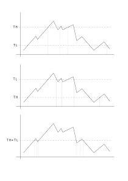

# Drempelwaarde-gebaseerde communicatie

Sommige sensoren zijn in staat om een interupt te genereren wanneer een bepaalde meetwaarde (drempel, E: threshold) wordt overschreden.
Indien ingeschakeld, zal u een update van de gemeten sensorwaarde ontvangen indien de drempel overschreden wordt.

Het is mogelijk om twee drempelwaarden te definiëren, d.w.z. lage drempelwaarde en hoge drempelwaarde: 
* Wanneer een meetwaarde boven de `threshold high (TH)` komt wordt er een interrupt gegenereerd.
* Wanneer een meetwaarde onder de `threshold low (TL)` komt wordt er een interrupt gegenereerd.
Dit stelt ons in staat om updates te krijgen op drie verschillende manieren.

In alle gevallen wordt een interrupt gegenereerd wanneer de metric waarde `TH` overschrijdt of wanneer deze onder `TL` komt. 
Door te spelen met de `TH` en `TL` configuratie kunnen we manipuleren wanneer we een update willen.

In de onderstaande figuur geven de gestippelde horizontale lijnen aan wanneer sensor data naar de gateway wordt gestuurd.

We beschrijven de situaties die in de bovenstaande figuur zijn weergegeven:

1. Bovenste figuur: Als we geïnteresseerd zijn om een melding te krijgen wanneer een waarde hoger is dan `TH` of lager dan `TL`, definiëren we: `TH` met een hogere waarde dan `TL`.
Bijvoorbeeld: als we sensor data willen krijgen wanneer een geluidsniveau hoger is dan 100 dB of wanneer het lager is dan 80 dB, dan stellen we `TH=100` in en `TL=80`.

2. Middelste figuur: Als we geïnteresseerd zijn wanneer een waarde in het gebied tussen `TH` en `TL` komt, heeft `TL` een hogere waarde dan `TH`.
Bijvoorbeeld: als we sensorgegevens willen krijgen wanneer een geluidsniveau tussen 80 en 100 dB ligt, stellen we `TH=80` en `TL=100` in.

3. Onderste figuur: Als we willen weten wanneer een metrische waarde een bepaalde waarde overschrijdt, kunnen we `TH` gelijk aan `TL` definiëren.
Bijvoorbeeld: als we sensor data willen krijgen wanneer een geluidsniveau 85 dB overschrijdt, ongeacht of het geluidsniveau daarvoor hoger of lager was, dan stellen we `TH=85` en `TL=85` in.

In de tabel hieronder vindt u de minimum en maximum waarden die `TL` en `TH` kunnen hebben, voor elke fysieke grootheid en elke sensor.

| Sensor type | Fysieke hoeveelheid | minimum | maximum |
| ------------- |:-------------:|:-------------:|:-------------:| 
| Geluidsniveau sensor | Geluidsniveau (dB) | 65 | 120 |
| Omgevingssensor | Temperatuur (&deg;C) | -40 | 100 |
| Omgevingssensor | Luchtdruk (hPa) | 0 | 65000 |
| Milieusensor | Vochtigheid (%) | 0 | 100 |
| Milieusensor | Luchtkwaliteit (geen eenheid) 0 600
| Knopsensor | - (geen drempel) | - (geen drempel) | - (geen drempel) |
| Lichtsensor | Verlichtingssterkte (lux) | 0 | 65535 |
| Stroom | Batterijspanning (V) | 0 | 4.20 |

__Pas op!__ Door de manier waarop geluidsniveaus worden berekend, is het gemeten geluidsniveau altijd ten minste 50 dB. Daarom heeft het geen zin om te proberen 'stille' geluiden te meten.
Het is ook niet toegestaan om drempels lager dan 65 dB in te stellen, omdat dit zal leiden tot constante datatransmissie, wat veel stroom verbruikt en de batterij leeg zal trekken.
